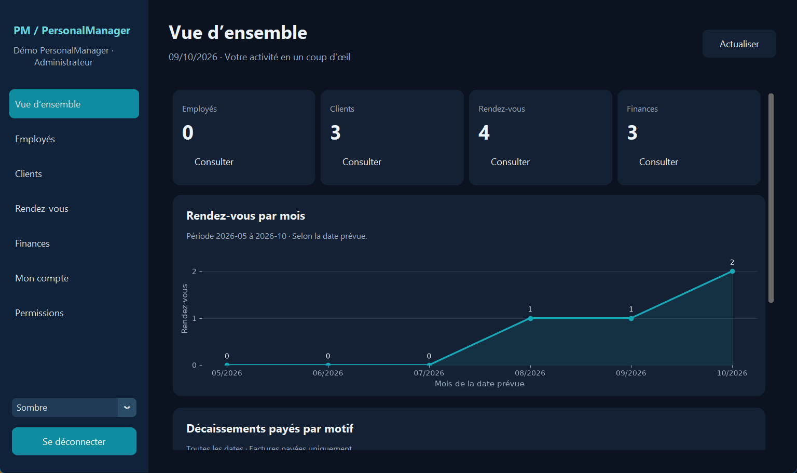
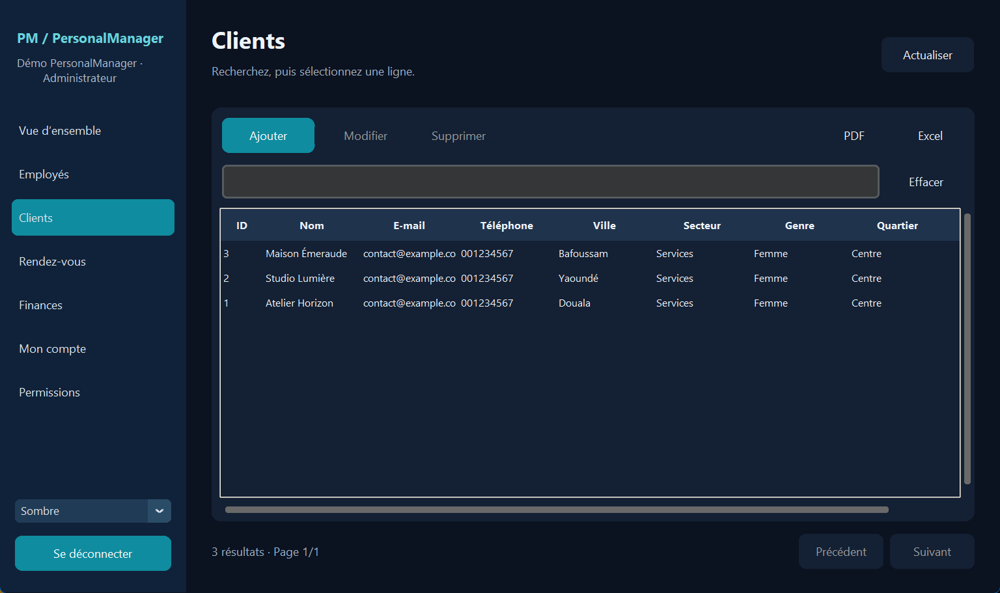
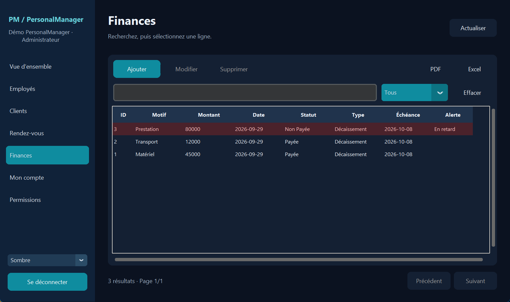

# PersonalManager

Application de gestion locale pour petites structures : équipes, clients,
rendez-vous et transactions financières dans une fenêtre CustomTkinter.

Le projet a été modernisé progressivement : migrations SQLite sans suppression
des données, mots de passe bcrypt, tableau de bord Matplotlib, formulaires validés,
recherche, exports Excel/PDF et permissions vérifiées dans le backend.

## Fonctionnalités

- Tableau de bord avec compteurs, rendez-vous par mois et dépenses payées par motif.
- Création, modification et suppression des données métier par un administrateur.
- Recherche dynamique, filtres de statut et pagination cohérente.
- Exports Excel/PDF de tous les résultats filtrés, jusqu’à 10 000 lignes.
- Employés en consultation/export des clients et rendez-vous ; finances réservées
 aux administrateurs. Attribution des rôles et protection du dernier administrateur.
- Alertes pour les rendez-vous du jour et les factures non payées avec échéance dépassée.
- Thèmes clair/sombre, messages d’erreur et journal local sans valeurs sensibles.

## Aperçu

<!-- screenshots:start -->
Captures du vrai logiciel, avec des données de démonstration temporaires.







<!-- screenshots:end -->

## Lancer depuis les sources sous Windows

Utiliser un Python standard (pas la variante free-threaded). Les tests CI
utilisent Python 3.11 ; le développement Windows a aussi été vérifié en 3.14.
Tkinter et SQLite sont fournis avec Python : ne pas tenter de les installer via pip.

```bat
py -V:3.14 -m venv .venv
.venv\Scripts\python.exe -m pip install -r requirements.txt
.venv\Scripts\python.exe main.py
```

Si Python 3.14 n’est pas installé, utiliser la version disponible avec `py --list`
et adapter la première commande. L’activation de l’environnement n’est pas requise.

Le premier compte d’une base vide est administrateur. Les comptes suivants sont
employés ; un administrateur peut ensuite leur attribuer des droits.

## Exécutable Windows

La construction PyInstaller est configurée, mais le binaire doit être construit
et validé sur Windows avant publication. Aucun exécutable précompilé n’est inclus
à ce stade dans ce dépôt.

```bat
.venv\Scripts\python.exe -m pip install -r requirements-build.txt
.venv\Scripts\python.exe -m PyInstaller --clean --noconfirm PersonalManager.spec
```

Le résultat est `dist\PersonalManager\PersonalManager.exe`. Distribuer **tout le
dossier PersonalManager**, avec son répertoire `_internal`, dans une archive ZIP.
Après extraction, un double-clic sur l’exécutable lance l’application sans Python.
Le mode dossier permet de conserver les ressources graphiques et polices incluses.

Vérifier les dépendances embarquées avant la revue visuelle :

```bat
start /wait "" "dist\PersonalManager\PersonalManager.exe" --self-test-result "%TEMP%\personalmanager-build-check.json"
```

Le fichier JSON doit contenir `"ok": true`. Ce contrôle utilise une base temporaire,
vérifie bcrypt, SQLite, Matplotlib, Excel et les polices PDF. Il ne remplace pas
un test interactif de la fenêtre et des formulaires.

## Données et diagnostic

| Exécution | Base utilisée par défaut |
| --- | --- |
| Sources | `projet_stage.db` dans le dossier du projet |
| Exécutable Windows | `%LOCALAPPDATA%\PersonalManager\projet_stage.db` |
| Variable `PERSONAL_MANAGER_DB` | Chemin choisi explicitement, dans les deux modes |

Les données restent locales et les migrations sont transactionnelles. L’exécutable
ne contient aucune base personnelle. Fermer l’application avant de copier une base.

Pour tester sans modifier la base habituelle :

```bat
copy projet_stage.db "%TEMP%\personalmanager-demo.db"
set "PERSONAL_MANAGER_DB=%TEMP%\personalmanager-demo.db"
.venv\Scripts\python.exe main.py
set "PERSONAL_MANAGER_DB="
```

Les diagnostics Windows se trouvent dans
`%LOCALAPPDATA%\PersonalManager\logs\application.log`. Ils contiennent les types
d’erreur et les noms de fonctions/lignes, sans le texte des exceptions, les mots
de passe ou les paramètres SQL.

## Architecture

```text
main.py                  lancement et contrôle de l’exécutable
backend/connection.py    connexions courtes, transactions et fermeture explicite
backend/migrations.py    versions de schéma et migrations des comptes
backend/auth.py          validation d’inscription et bcrypt
backend/permissions.py   droits relus en base, gestion des rôles
backend/management.py    validation et opérations métier
backend/dashboard.py     recherche, pagination et instantanés d’export
backend/statistics.py    calculs sans dépendance aux widgets
backend/alerts.py        alertes à partir des dates explicites
backend/reporting.py     rapports Excel/PDF et écriture atomique
ui/application.py        fenêtre unique, navigation, formulaires et travail en arrière-plan
ui/charts.py             figures Matplotlib
tools/                   contrôles de distribution et captures
tests/                   tests backend, rapports et widgets Windows
```

Les requêtes et bcrypt s’exécutent dans un fil de travail. Seul le fil Tkinter
modifie les widgets ; les résultats obsolètes sont rejetés après navigation.

## Tests et méthode de développement

```bat
.venv\Scripts\python.exe -m pip install -r requirements-dev.txt
.venv\Scripts\python.exe tests/run_tests.py
```

La suite comporte **97 tests**. Le lanceur refuse les tests ignorés. Les tests
de widgets nécessitent un bureau graphique. Les workflows GitHub comprennent
les tests Windows et une construction manuelle avec contrôle du binaire.

L’historique distingue corrections du schéma, connexions, authentification,
interface, opérations métier, graphiques, recherche, rôles, rapports et livraison.
Les explications pédagogiques et les procédures de validation sont dans
[le guide de phase 4](docs/PHASE_4.md) et les guides précédents du dossier `docs/`.

## Limites actuelles

- Application mono-poste : les permissions ne chiffrent pas le fichier SQLite et
 les données métier sont partagées entre comptes autorisés.
- Montants entiers, sans devise stockée ; pas de gestion des centimes.
- Les dates historiques ambiguës doivent être corrigées explicitement.
- L’échéance financière est facultative ; une facture sans échéance n’est pas
 déclarée arbitrairement en retard.
- La réinitialisation du mot de passe et les notifications système ne sont pas implémentées.
- L’ancienne interface est conservée pour l’historique ; utiliser `main.py`.

Ne pas publier sa base personnelle ou ses caches. Le guide de phase 4 fournit
un outil qui retire les fichiers déjà suivis par Git tout en les conservant sur
le disque. Cela ne réécrit pas l’ancien historique.
